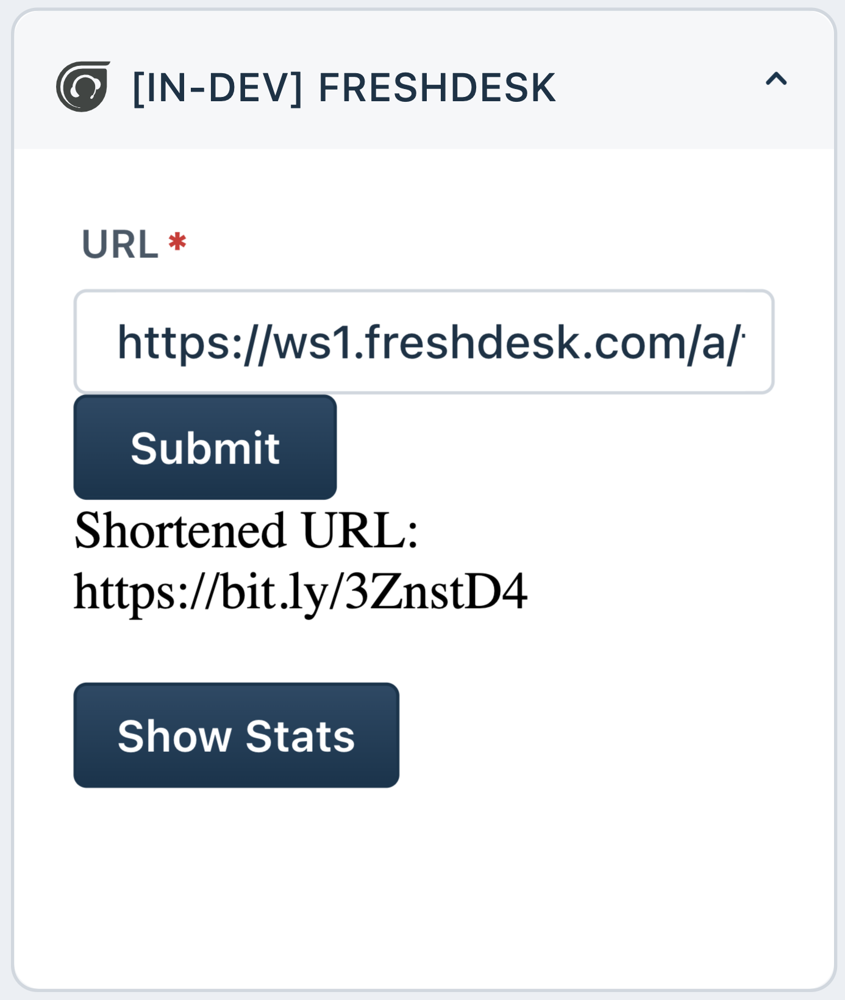

# Use Case: Bitly Integration with Freshdesk/Freshservice

- [Use Case: Bitly Integration with Freshdesk/Freshservice](#use-case-bitly-integration-with-freshdeskfreshservice)
  - [Solution Overview](#solution-overview)
  - [Prerequisites](#prerequisites)
    - [Necessary Account Creations and API Docs Links:](#necessary-account-creations-and-api-docs-links)
      - [How to Get API Key/Access Token](#how-to-get-api-keyaccess-token)
  - [Implementation Steps](#implementation-steps)
  - [Sample App](#sample-app)
      - [Freshdesk App](#freshdesk-app)
      - [Freshservice App](#freshservice-app)

## Solution Overview
- Integrate Bitly with Freshdesk/Freshservice to enable support agents to shorten URLs directly within ticket conversations.
- Utilize Freddy Copilot for Developers to simplify the integration process and accelerate app development.

## Prerequisites

1. A Bitly account with access to the desired Bitlinks.
2. A Freshdesk/Freshservice account with administrative privileges.

### Necessary Account Creations and API Docs Links:
1. **Bitly Account**: [Create](https://bitly.com/a/sign_up) or log in to your Bitly account. Refer to [Bitly API Documentation](https://dev.bitly.com/api-reference) for more
2. **Freshdesk Account:** [Create](https://developers.freshworks.com/docs/guides/setup/product-signup/) or log in to your Freshdesk account. Refer [Freshdesk API Documentation](https://developers.freshdesk.com/api/) for more information
3. **Freshservice Account:** [Create](https://developers.freshworks.com/docs/guides/setup/product-signup/) or log in to your Freshservice account. Refer [Freshservice API Documentation](https://api.freshservice.com/) for more information

#### How to Get API Key/Access Token
**Bitly Access Token:**
1. Log in to your Bitly account.
2. Navigate to your account settings and generate a generic access token.

**Freshdesk/Freshservice API Key:**
1. Log in to your Freshdesk/Freshservice admin dashboard.
2. Navigate to "Profile settings" > "API" tab.
3. Generate an API key or use an existing one.

## Implementation Steps

1. **Authentication and Setup**:
   - Authenticate with the Bitly API and obtain necessary credentials.
   - Configure the settings using [custom config page](http://localhost:10001/custom_config) for custom app.
   - Configure Bitly settings and define default preferences for URL shortening.

2. **Integration with Freshdesk/Freshservice**:
   - Use Freddy Copilot to access Freshdesk/Freshservice APIs and SDKs for ticket management and conversation handling.
      **For Freshdesk**
      ```md
      "I want a Bitly integration available within every ticket in Freshdesk. Upon clicking a button, use the Bitly API to shorten the URL provided in the ticket and display the shortened URL on the UI for easy sharing."
      ```
      **For Freshservice**
      ```md
      "I want a Bitly integration available within every ticket in Freshservice. Upon clicking a button, use the Bitly API to shorten the URL provided in the ticket and display the shortened URL on the UI for easy sharing."
      ```
   - Implement custom actions or triggers within Freshdesk/Freshservice to initiate URL shortening.

3. **Shortening URLs**:
   - Integrate Bitly URL shortening functionality within Freshdesk/Freshservice ticket interface.
   - Enable agents to shorten URLs directly from ticket conversations, replacing long URLs with shortened versions.

4. **Inserting Shortened URLs**:
   - Provide agents with the ability to insert shortened URLs into ticket responses or comments seamlessly.
   - Ensure that shortened URLs maintain their functionality and redirect users to the original destination.

5. **Tracking Click Analytics**:
   - Optionally, integrate Bitly click tracking functionality to monitor the performance of shortened URLs.

      ```md
      How to build an app from scratch
      ```
   - Enable agents to view click analytics directly within Freshdesk/Freshservice for better insights into customer engagement.

## Sample App

For reference purpose we have created a sample app that demonstrates Bitly Integration with Freshdesk via [Bitly Freshdesk App](/code_samples/bitly/freshdesk/) and Freshservice via Freshdesk via [Bitly Freshdesk App](/code_samples/bitly/freshservice/)

#### Freshdesk App

The sample app under ticket sidebar for Freshdesk will apear as below



#### Freshservice App

The sample app under ticket sidebar for Freshservice will apear as below


