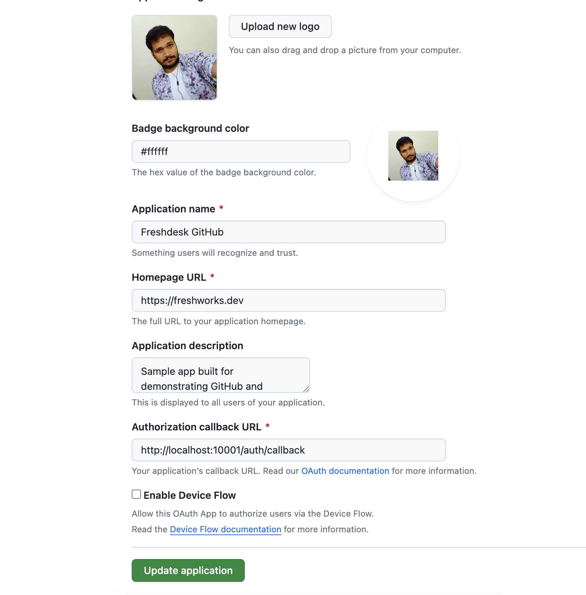
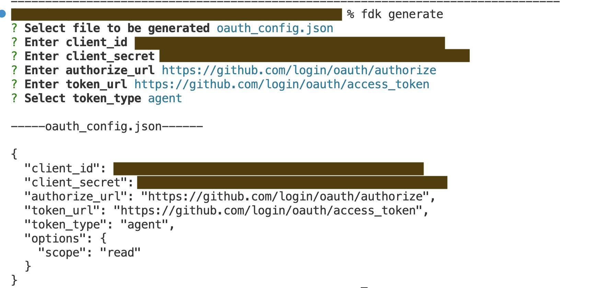
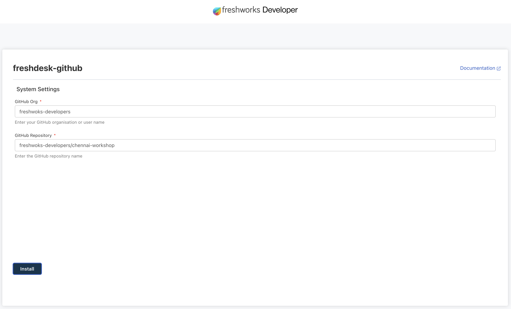
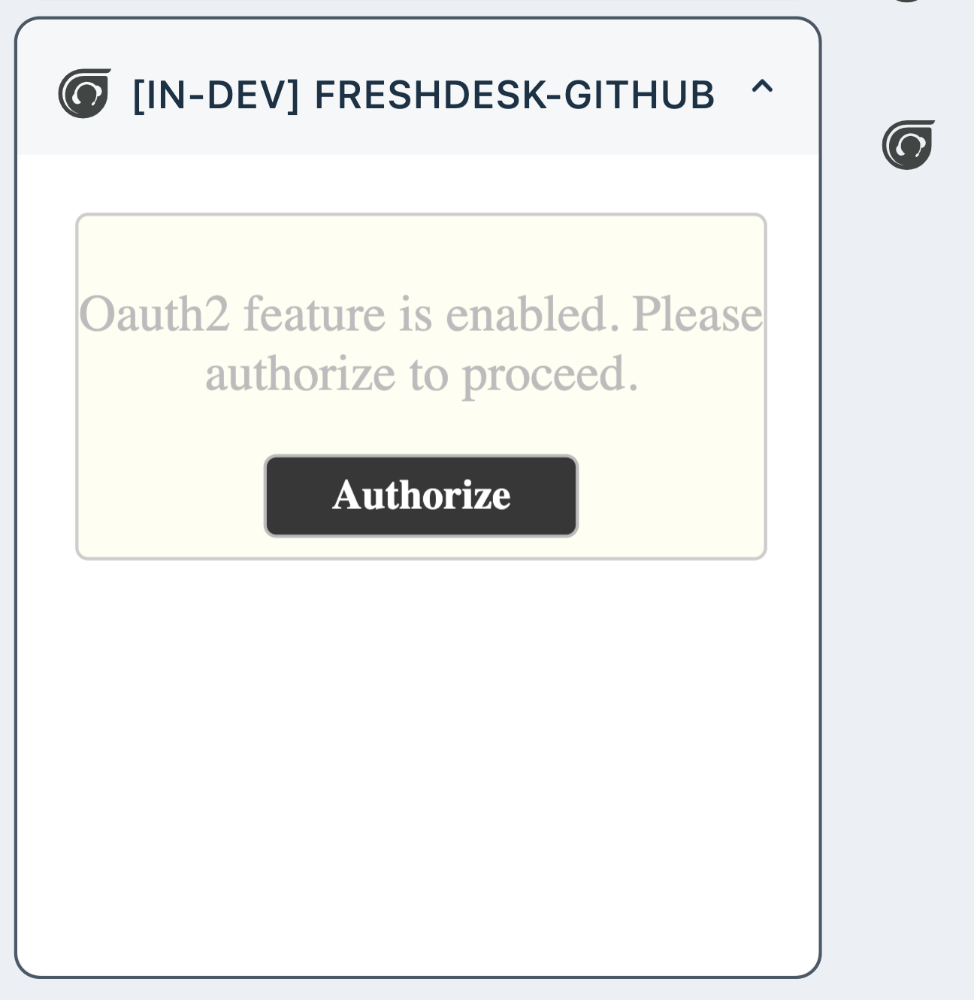
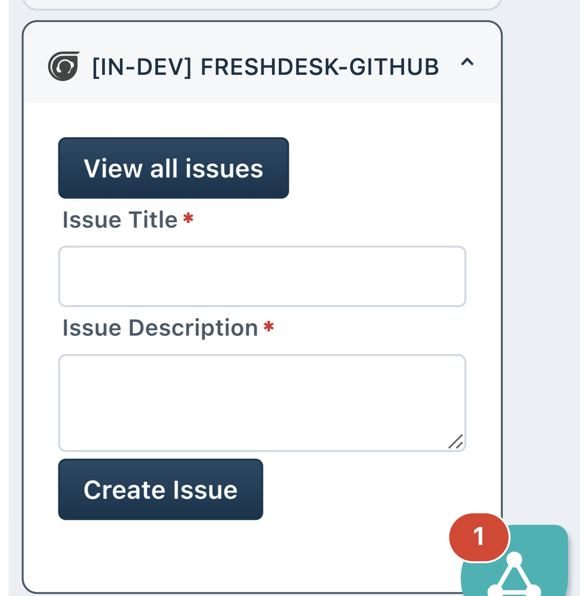
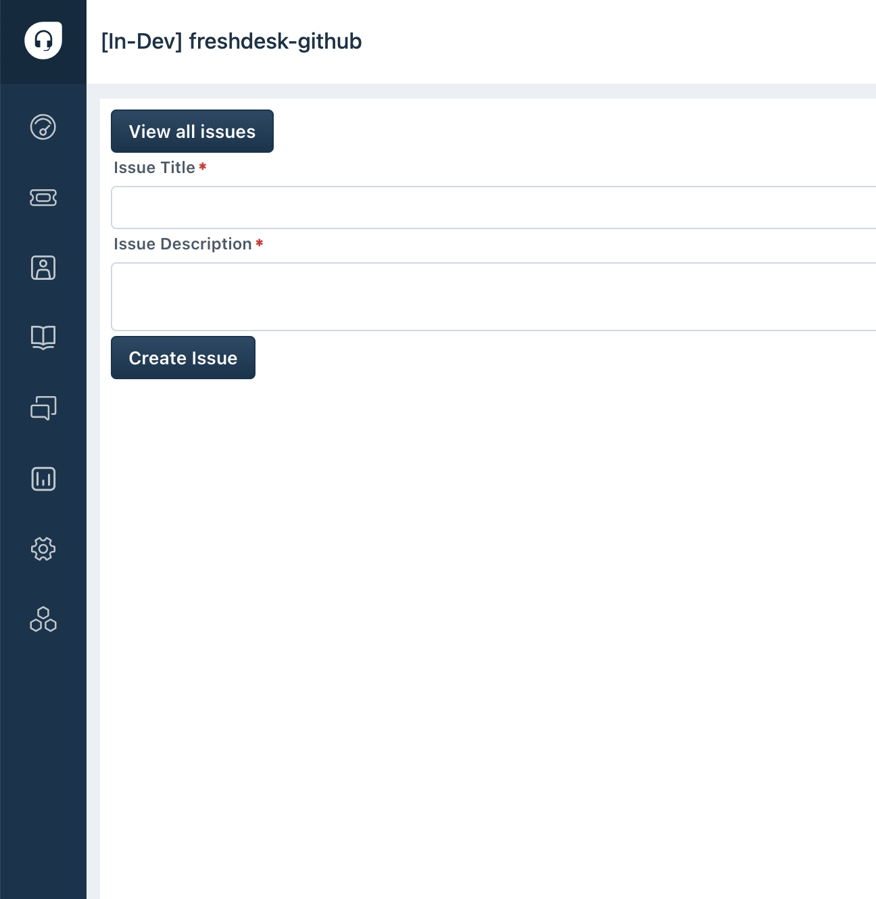

# Solution: GitHub Integration with Freshdesk/Freshservice

- [Solution: GitHub Integration with Freshdesk/Freshservice](#solution-github-integration-with-freshdeskfreshservice)
  - [Solution Overview](#solution-overview)
  - [Prerequisites](#prerequisites)
    - [Necessary Account Creations and API Docs Links:](#necessary-account-creations-and-api-docs-links)
      - [How to Get API Key/Access Token](#how-to-get-api-keyaccess-token)
  - [Implementation Steps](#implementation-steps)
  - [Sample App](#sample-app)
      - [App Configuration on GitHub](#app-configuration-on-github)
      - [OAuth Configuration generation via CLI](#oauth-configuration-generation-via-cli)
      - [Installation Parameters setting sameple](#installation-parameters-setting-sameple)
      - [Sidebar App rending for OAuth enabled apps](#sidebar-app-rending-for-oauth-enabled-apps)
      - [Sidebar App rending for Create Issue](#sidebar-app-rending-for-create-issue)
      - [Full page App rending](#full-page-app-rending)

## Solution Overview
- Integrate GitHub, a popular code repository and issue tracking platform, with Freshdesk to enable support agents to create and track GitHub issues directly from Freshdesk tickets.
- Utilize Freddy Copilot to simplify the integration process and accelerate app development.

## Prerequisites

1. A GitHub account with access to repositories and issues.
2. A Freshdesk account with administrative privileges.

### Necessary Account Creations and API Docs Links:
1. **GitHub Account**: [Create](https://github.com/join) or log in to your GitHub account. Refer to [GitHub API Documentation](https://docs.github.com/en/rest?apiVersion=2022-11-28) for more details
2. **Freshdesk Account:** [Create](https://developers.freshworks.com/docs/guides/setup/product-signup/) or log in to your Freshdesk account. Refer [Freshdesk API Documentation](https://developers.freshdesk.com/api/) for more information

#### How to Get API Key/Access Token
**GitHub Personal Access Token:**
1. Log in to your GitHub account.
2. Go to [GitHub's Developer settings](https://github.com/settings/developers) and generate a new personal access token with the necessary permissions (e.g., repo, issue).

**Freshdesk API Key:**
1. Log in to your Freshdesk admin dashboard.
2. Navigate to "Profile settings" > "API" tab.
3. Generate an API key or use an existing one.

## Implementation Steps

1. **Authentication and Setup**:
   - Authenticate with the GitHub API and obtain necessary credentials.
   - Configure the settings using [custom config page](http://localhost:10001/custom_config) for custom app.
   - Configure access permissions and define repository settings for issue tracking.

2. **Integration with Freshdesk/Freshservice**:
   - Use Freddy Copilot to access Freshdesk APIs and SDKs for ticket management and conversation handling.

      ```md
      I want to create a GitHub integration with Freshdesk. I want to be able to create a GitHub issue and also fetch the list of issues on click of button. I want to display the list of issues in a datatable
      ```
   - Implement custom actions or triggers within Freshdesk to initiate GitHub issue creation.

3. **Creating GitHub Issues from Freshdesk/Freshservice**:
   - Integrate GitHub issue creation functionality within Freshdesk ticket interface.
   - Enable agents to create GitHub issues directly from Freshdesk tickets, providing relevant details and context.

4. **Linking Tickets and GitHub Issues**:
   - Establish bi-directional links between Freshdesk tickets and corresponding GitHub issues to maintain synchronization.
   - Update ticket status and add comments in Freshdesk based on GitHub issue activities, and vice versa.

5. **Collaboration and Resolution**:
   - Facilitate communication and collaboration between support and development teams by providing visibility into GitHub issues within Freshdesk.
   - Enable seamless handoff of issues between support and development teams, with status updates reflected in both platforms.

## Sample App

For reference purpose we have created a sample app that demonstrates GitHub Integration with Freshdesk via [Freshdesk GitHub App](/code_samples/github/freshdesk-github/) and for Freshservice via [Freshservice GitHub App](/code_samples/github/freshservice-github/)

#### App Configuration on GitHub

Under developer settings, create a new OAuth App. Create access token and note down client ID and Client Secret



#### OAuth Configuration generation via CLI

From command line, run `fdk generate` to create OAuth configuration file. When prompted enter the values as applicable



#### Installation Parameters setting sameple

Launch the installation parameters from `http://localhost:10001/custom_config` page and add the settings as applicable



#### Sidebar App rending for OAuth enabled apps

When launched with `?dev=true` the app will be rendered in sidebar with OAuth as follows



#### Sidebar App rending for Create Issue

When launched with `?dev=true` the app will be rendered in sidebar with create issue option



#### Full page App rending

When launched with `?dev=true` the app will be rendered in sidebar with OAuth as follows



