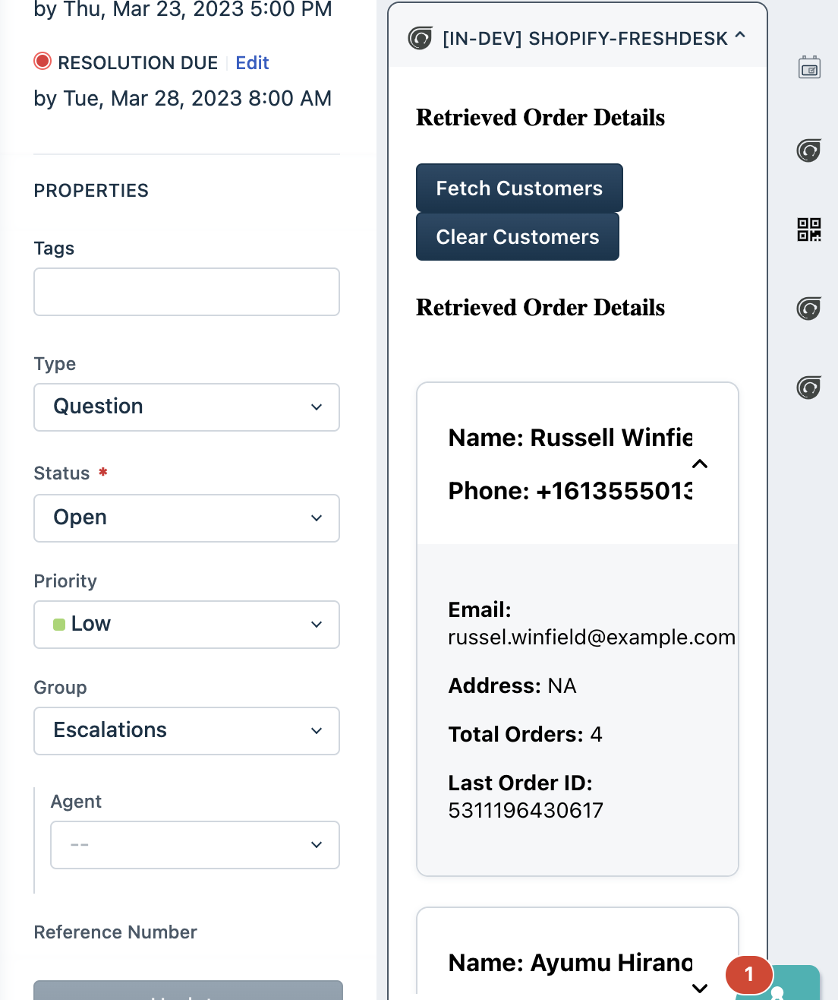
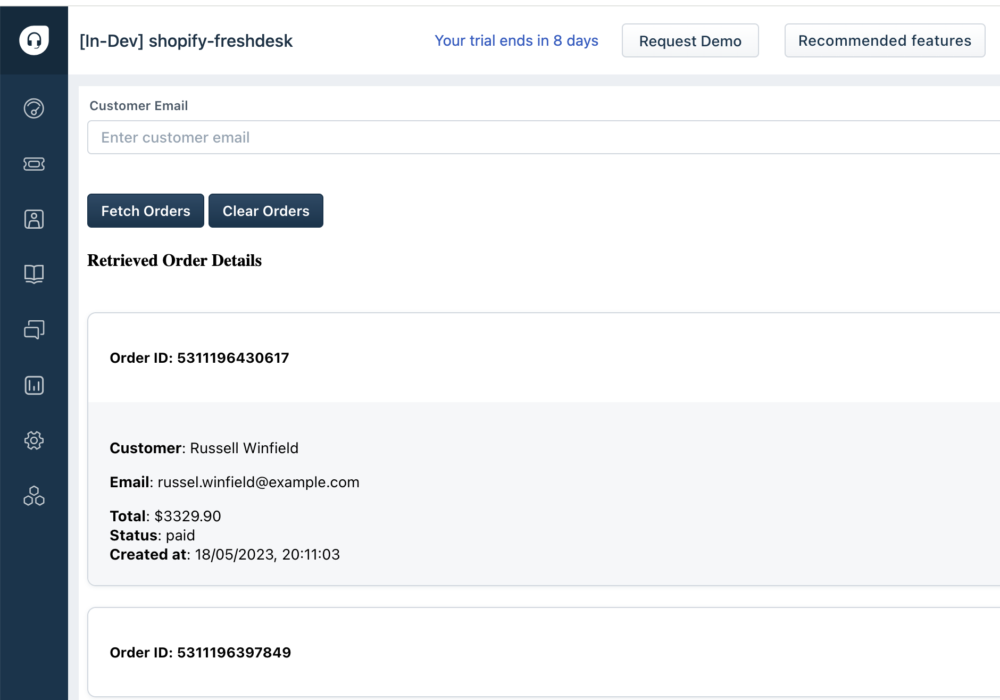

# Solution: Shopify Integration with Freshdesk

- [Solution: Shopify Integration with Freshdesk](#solution-shopify-integration-with-freshdesk)
  - [Solution Overview](#solution-overview)
  - [Prerequisites](#prerequisites)
    - [Necessary Account Creations and API Docs Links:](#necessary-account-creations-and-api-docs-links)
      - [How to Get API Key/Access Token](#how-to-get-api-keyaccess-token)
  - [Implementation Steps](#implementation-steps)
  - [Sample App](#sample-app)

## Solution Overview
- Integrate Shopify with Freshdesk to enable support agents to retrieve order details, track shipments, and resolve customer inquiries directly from Freshdesk.
- Utilize Freddy Copilot to simplify the integration process and accelerate app development.

## Prerequisites

1. A Shopify store account with active products and orders.
2. A Freshdesk account with administrative privileges.

### Necessary Account Creations and API Docs Links:
1. **Shopify Account:** [Create](https://shopify.dev/docs/apps/tools/development-stores#create-a-development-store-to-test-your-app) or log in to your Shopify store account. Refer [Shopify Documentation](https://shopify.dev/docs) for more information
2. **Freshdesk Account:** [Create](https://developers.freshworks.com/docs/guides/setup/product-signup/) or log in to your Freshdesk account. Refer [Freshdesk API Documentation](https://developers.freshdesk.com/api/) for more information

#### How to Get API Key/Access Token
**Shopify API Key:**
1. Log in to your Shopify admin dashboard.
2. Navigate to the "Apps" section.
3. Click on "Manage private apps" or "Create App" depending on your Shopify plan.
4. Generate a private app and obtain the API key and password.

**Freshdesk API Key:**
1. Log in to your Freshdesk admin dashboard.
2. Navigate to "Profile settings" > "API" tab.
3. Generate an API key or use an existing one.

## Implementation Steps

1. **App Creation**:
   - Authenticate with the Shopify API and obtain necessary credentials.
   - Configure access permissions and define default settings for order retrieval in store configuration.

2. **Integration with Freshdesk**:
   - Use Freddy Copilot to access Freshdesk APIs and SDKs for ticket management and conversation handling.
      ```md
      I want a Shopify integration where support agents can view customer orders via email ID. Upon clicking on a button, fetch order details from Shopify API and display them alongside the ticket information.
      ```
   - Configure the settings using [custom config page](http://localhost:10001/custom_config) for custom app.
   - Implement custom actions or triggers within Freshdesk to initiate order retrieval from Shopify.

3. **Retrieving Order Details**:
   - Integrate Shopify functionality within Freshdesk ticket interface.
   - Enable agents to retrieve order details by entering relevant order IDs or customer information directly from ticket conversations.

4. **Displaying Order Information**:
   - Display order details, including order status, items purchased, shipping information, etc., within Freshdesk ticket interface.
   - Ensure that agents have access to real-time order updates and tracking information to provide timely support to customers.
      ```md
      Display the fetched order information in a collapsable accordion card
      ```

5. **Updating Order Status and Notes**:
   - Enable agents to update order status, add internal notes, or communicate with customers regarding order-related inquiries directly within Freshdesk.
      ```md
      Update the order information for the retrieved order and save it in shopify store
      ```

## Sample App

For reference purpose we have created a sample app that demonstrates Shopify Stores Integration with Freshdesk via [Shopify Freshdesk App](/code_samples/shopify-freshdesk)

The sample app under ticket sidebar will apear as below



The sample app as a full page app will apear as below


