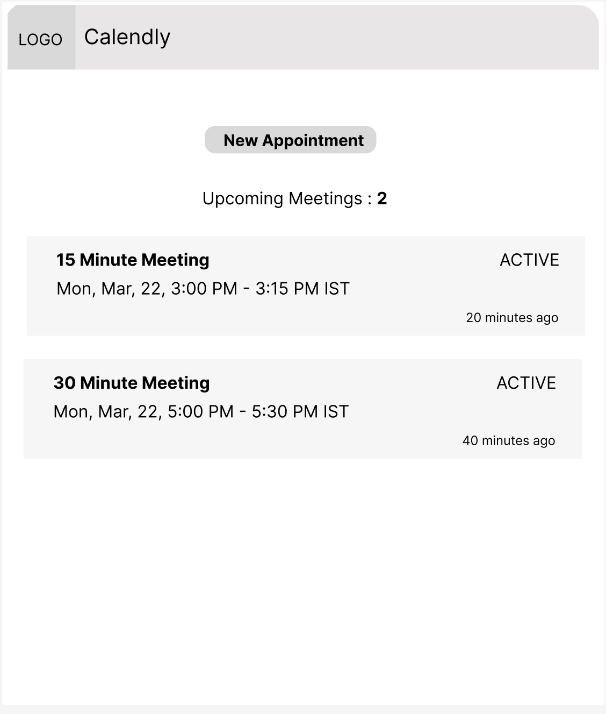

# Use Case: Calendly Integration with Freshdesk

- [Use Case: Calendly Integration with Freshdesk](#use-case-calendly-integration-with-freshdesk)
  - [Problem Statement](#problem-statement)
  - [Solution Overview](#solution-overview)
  - [Implementation Steps](#implementation-steps)
  - [Wireframe](#wireframe)
  - [Benefits](#benefits)

## Problem Statement
- Customer support teams often need to schedule meetings or appointments with customers to resolve issues or provide assistance.
- Manually coordinating schedules and sending meeting invitations can be time-consuming and prone to errors.
- Streamlining the scheduling process within Freshdesk can improve efficiency and enhance customer experience.

## Solution Overview
- Integrate Calendly, a popular scheduling tool, with Freshdesk to enable agents to schedule meetings directly within ticket conversations.
- Utilize Freddy Copilot for Developers to simplify the integration process and accelerate app development.

## Implementation Steps

1. **Authentication and Setup**:
   - Authenticate with the Calendly API and obtain necessary credentials.
   - Configure Calendly settings to define meeting types, availability, and other preferences.

2. **Integration with Freshdesk**:
   - Utilize Freddy Copilot for Developers to build app that enables you to perform ticket management and conversation handling.
   - Implement custom actions or triggers within Freshdesk to initiate the scheduling process.

3. **Scheduling Meetings**:
   - Integrate Calendly scheduling functionality within Freshdesk ticket interface.
   - Enable agents to select available time slots, add meeting details, and send meeting invitations to customers directly from the ticket.

4. **Automated Notifications**:
   - Configure automated notifications to inform agents and customers about scheduled meetings.
   - Use Freshdesk automation rules or Calendly webhook integrations to trigger notifications based on specific events.

5. **Tracking and Reporting**:
   - Implement tracking mechanisms to record scheduled meetings and associated ticket details.
   - Generate reports and insights on meeting activities to measure the impact on customer support operations.

## Wireframe

## Benefits
- **Improved Efficiency**: Agents can schedule meetings without leaving the Freshdesk interface, reducing context switching and saving time.
- **Enhanced Customer Experience**: Seamless scheduling experience enhances customer satisfaction and strengthens relationships.
- **Automated Processes**: Integration enables automation of scheduling tasks, reducing manual effort and minimizing errors.
- **Insights and Analytics**: Tracking meeting activities provides valuable insights for performance analysis and optimization.
