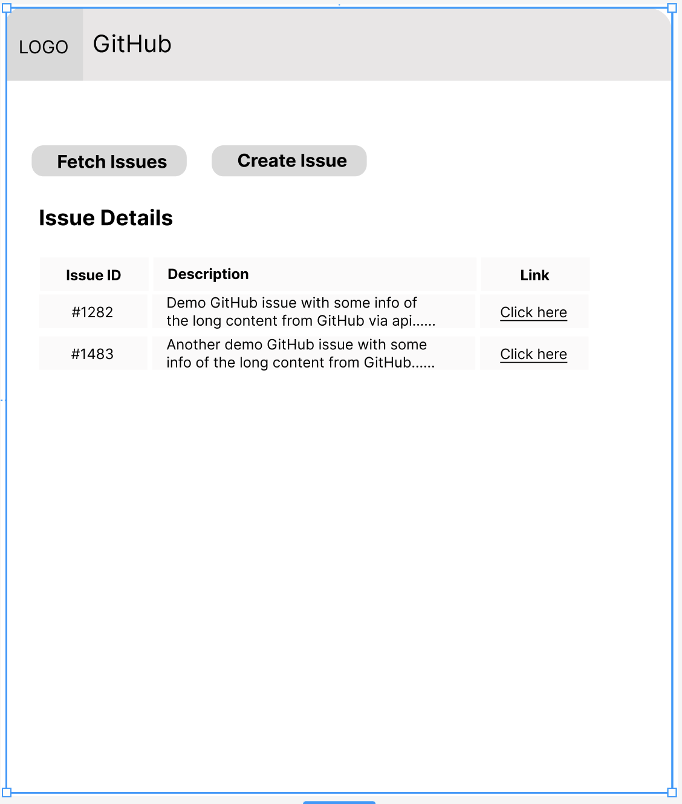

# Use Case: GitHub Integration with Freshdesk

- [Use Case: GitHub Integration with Freshdesk](#use-case-github-integration-with-freshdesk)
  - [Problem Statement](#problem-statement)
  - [Solution Overview](#solution-overview)
  - [Implementation Steps](#implementation-steps)
  - [Wireframe](#wireframe)
  - [Benefits](#benefits)

## Problem Statement
- Many customer support issues reported through Freshdesk may require collaboration with development teams for resolution.
- Lack of visibility and communication between support and development teams can lead to delays in issue resolution and poor customer experience.
- Integrating GitHub with Freshdesk can facilitate seamless collaboration and streamline issue tracking and resolution processes.

## Solution Overview
- Integrate GitHub, a popular code repository and issue tracking platform, with Freshdesk to enable support agents to create and track GitHub issues directly from Freshdesk tickets.
- Utilize Freddy AI Copilot for Developers to simplify the integration process and accelerate app development.

## Implementation Steps

1. **Authentication and Setup**:
   - Authenticate with the GitHub API and obtain necessary credentials.
   - Configure access permissions and define repository settings for issue tracking.

2. **Integration with Freshdesk**:
   - Use Freddy AI Copilot for Developers to access Freshdesk APIs and SDKs for ticket management and conversation handling.
   - Implement custom actions or triggers within Freshdesk to initiate GitHub issue creation.

3. **Creating GitHub Issues from Freshdesk**:
   - Integrate GitHub issue creation functionality within Freshdesk ticket interface.
   - Enable agents to create GitHub issues directly from Freshdesk tickets, providing relevant details and context.

4. **Linking Tickets and GitHub Issues**:
   - Establish bi-directional links between Freshdesk tickets and corresponding GitHub issues to maintain synchronization.
   - Update ticket status and add comments in Freshdesk based on GitHub issue activities, and vice versa.

5. **Collaboration and Resolution**:
   - Facilitate communication and collaboration between support and development teams by providing visibility into GitHub issues within Freshdesk.
   - Enable seamless handoff of issues between support and development teams, with status updates reflected in both platforms.

## Wireframe

## Benefits
- **Streamlined Collaboration**: Integration enables seamless communication and collaboration between support and development teams, leading to faster issue resolution.
- **Enhanced Visibility**: Agents have visibility into GitHub issues directly from Freshdesk, improving context and understanding of customer-reported issues.
- **Improved Efficiency**: Agents can create GitHub issues without leaving the Freshdesk interface, reducing context switching and improving workflow efficiency.
- **Transparent Issue Tracking**: Bi-directional linking ensures that issue status and updates are synchronized between Freshdesk and GitHub, providing transparency and accountability.
