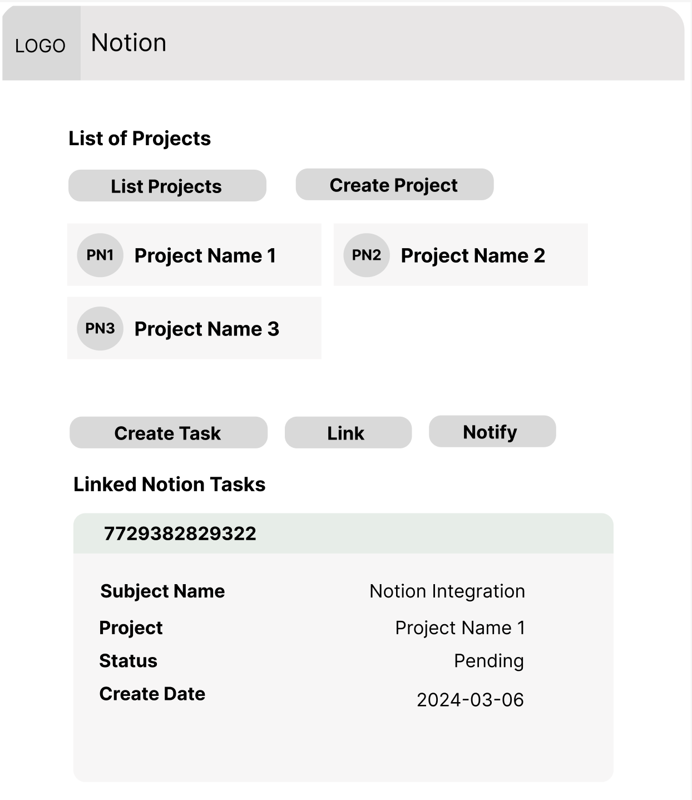
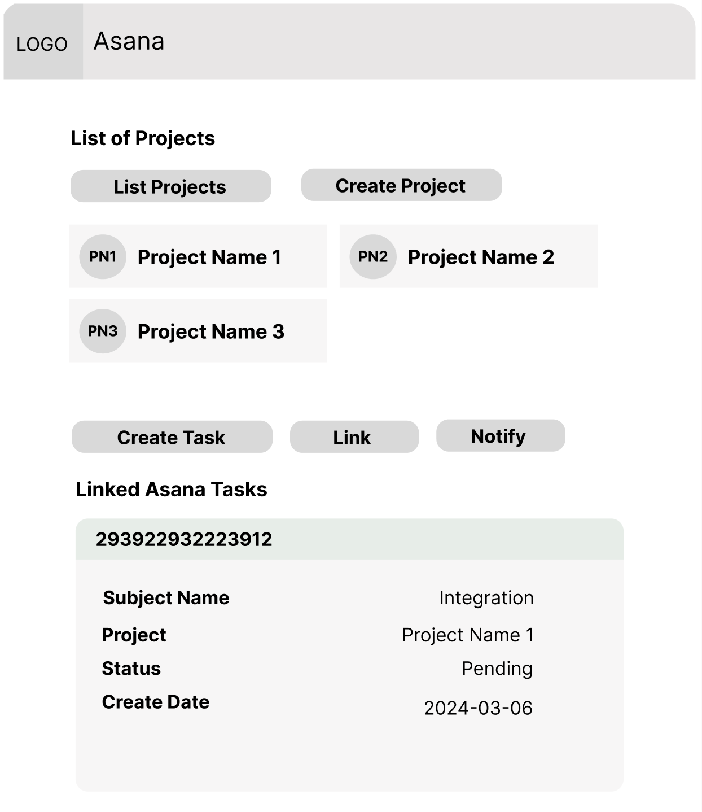

# Use Case: Notion and Asana Integration with Freshdesk/Freshservice

- [Use Case: Notion and Asana Integration with Freshdesk/Freshservice](#use-case-notion-and-asana-integration-with-freshdeskfreshservice)
  - [Problem Statement](#problem-statement)
  - [Solution Overview](#solution-overview)
  - [Implementation Steps](#implementation-steps)
  - [Wireframe](#wireframe)
    - [Notion Wireframe](#notion-wireframe)
    - [Asana Wireframe](#asana-wireframe)
  - [Benefits](#benefits)

## Problem Statement
- Support agents often need to collaborate with other teams, such as product development or project management, to resolve customer issues effectively.
- Lack of integration between support tools like Freshdesk/Freshservice and collaboration platforms like Notion and Asana can lead to siloed workflows and inefficient communication.
- Integrating Notion and Asana with Freshdesk/Freshservice can streamline collaboration and improve cross-functional team alignment.

## Solution Overview
- Integrate Notion and Asana with Freshdesk/Freshservice to enable support agents to create tasks, projects, or documentation directly from ticket conversations.
- Utilize Freddy AI Copilot for Developers to simplify the integration process and accelerate app development.

## Implementation Steps

1. **Authentication and Setup**:
   - Authenticate with the APIs of Notion, Asana, Freshdesk, and Freshservice, and obtain necessary credentials.
   - Configure access permissions and define default settings for task/project creation.

2. **Integration with Freshdesk/Freshservice**:
   - Use Freddy AI Copilot for Developers to access Freshdesk/Freshservice APIs and SDKs for ticket management and conversation handling.
   - Implement custom actions or triggers within Freshdesk/Freshservice to initiate task/project creation in Notion and Asana.

3. **Creating Tasks/Projects**:
   - Integrate Notion and Asana functionality within Freshdesk/Freshservice ticket interface.
   - Enable agents to create tasks or projects directly from ticket conversations, providing relevant details and context.

4. **Linking Tickets and Tasks/Projects**:
   - Establish bi-directional links between Freshdesk/Freshservice tickets and corresponding tasks/projects in Notion and Asana to maintain synchronization.
   - Update ticket status and add comments in Freshdesk/Freshservice based on task/project activities, and vice versa.

5. **Collaboration and Resolution**:
   - Facilitate communication and collaboration between support and other teams by providing visibility into tasks/projects within Freshdesk/Freshservice.
   - Enable seamless handoff of issues between support and other teams, with status updates reflected in both platforms.

## Wireframe

### Notion Wireframe

### Asana Wireframe

## Benefits
- **Streamlined Collaboration**: Integration enables seamless communication and collaboration between support and other teams, leading to faster issue resolution.
- **Enhanced Visibility**: Agents have visibility into tasks/projects directly from Freshdesk/Freshservice, improving context and understanding of cross-functional activities.
- **Improved Efficiency**: Agents can create tasks/projects without leaving the Freshdesk/Freshservice interface, reducing context switching and improving workflow efficiency.
- **Transparent Tracking**: Bi-directional linking ensures that task/project status and updates are synchronized between Freshdesk/Freshservice and Notion/Asana, providing transparency and accountability.
